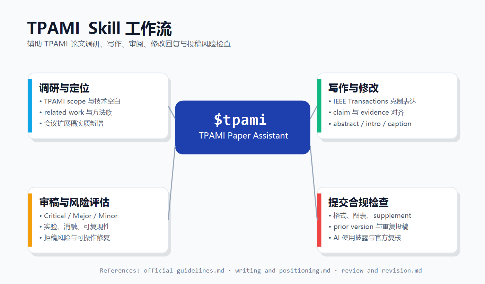

# TPAMI Skill

面向 TPAMI / T-PAMI / IEEE Transactions on Pattern Analysis and Machine Intelligence 论文工作的 Codex skill。它用于辅助论文调研、写作、审阅、修改回复和 IEEE/TPAMI 投稿风险检查，重点约束 Codex 按 TPAMI 风格关注技术深度、证据强度、期刊扩展价值和提交合规性。



## 适用场景

- **调研与定位**：判断选题是否符合 TPAMI 范围，梳理 related work、技术空白、方法族和潜在投稿风险。
- **写作与修改**：改写 abstract、introduction、method、experiment、caption、limitations 等，使表达更接近 IEEE Transactions 风格。
- **审稿与风险评估**：以 TPAMI reviewer 视角检查 significance、novelty、technical soundness、实验充分性、ablation、reproducibility、clarity、ethics 和 fit。
- **修改回复**：组织 response letter，合并 reviewer concern，给出逐条回应策略和手稿修改位置建议。
- **提交合规检查**：检查摘要、双栏版式、图表、appendix/supplement、会议扩展稿说明、重复投稿风险、AI 使用披露等。

## 目录结构

```text
tpami-skill/
├── SKILL.md
├── agents/
│   └── openai.yaml
├── references/
│   ├── official-guidelines.md
│   ├── review-and-revision.md
│   └── writing-and-positioning.md
└── assets/
    └── tpami-skill-overview.png
```

## 安装方式

将本仓库复制到本机 Codex skills 目录：

```powershell
Copy-Item -Recurse -Force . C:\Users\32434\.codex\skills\tpami
```

如果你的 Codex home 不在 `C:\Users\32434\.codex`，请复制到对应的 `skills\tpami` 目录。

## 使用示例

```text
Use $tpami to review this LaTeX manuscript for TPAMI fit, evidence strength, and submission risks.
```

```text
Use $tpami to turn this CVPR paper extension into a TPAMI positioning plan.
```

```text
Use $tpami to draft a response strategy for these reviewer comments.
```

```text
Use $tpami to audit this manuscript for IEEE/TPAMI compliance, prior-version disclosure, and AI-use disclosure.
```

## 参考文件说明

- `references/official-guidelines.md`：TPAMI/IEEE 官方指南摘要，覆盖范围、格式、伦理、AI 披露、重复投稿和扩展稿风险。
- `references/writing-and-positioning.md`：TPAMI 风格写作、贡献定位、会议扩展稿、实验组织和文献调研启发式规则。
- `references/review-and-revision.md`：审稿 checklist、常见拒稿风险、severity labels、response letter 写法。

## 参考来源

本 skill 的 TPAMI/IEEE 范围、格式、伦理和提交风险提示主要参考以下官方页面。正式投稿前应重新核对这些页面，因为期刊政策、模板、页数限制和提交流程可能变化。

- [TPAMI Call for Papers](https://www.computer.org/digital-library/journals/tp/cfp-ieee-pattern-analysis-machine-intelligence)
- [IEEE Computer Society Author Resources](https://www.computer.org/publications/author-resources)
- [IEEE Editorial Style Manual for Authors](https://journals.ieeeauthorcenter.ieee.org/wp-content/uploads/sites/7/IEEE-Editorial-Style-Manual-for-Authors.pdf)
- [IEEE Submission and Peer Review Policies](https://journals.ieeeauthorcenter.ieee.org/become-an-ieee-journal-author/publishing-ethics/guidelines-and-policies/submission-and-peer-review-policies/)
- [IEEE Article Templates](https://journals.ieeeauthorcenter.ieee.org/create-your-ieee-journal-article/authoring-tools-and-templates/tools-for-ieee-authors/ieee-article-templates/)

## 重要说明

官方 IEEE/TPAMI 规则可能变化。用于正式投稿、AI 披露、页数限制、appendix/supplement、重复投稿或版权许可判断时，应在提交前重新核对 IEEE 和 TPAMI 官方页面。本 skill 只提供写作、审阅和风险检查辅助，不替代作者对事实、署名、权限、伦理和最终提交决定的责任。
